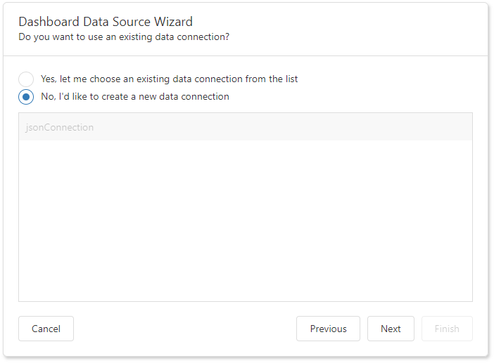

<!-- default badges list -->

<!-- default badges end -->

# Dashboard for ASP.NET Core - How to create new JSON data sources at runtime

You can provide end users with the capability to create a new data connection for a [JSON Data Source](https://docs.devexpress.com/Dashboard/DevExpress.DashboardCommon.DashboardJsonDataSource) at runtime.

## Example Overview

### Server

On the server side, implement the [IDataSourceWizardConnectionStringsStorage](https://docs.devexpress.com/Dashboard/DevExpress.DashboardWeb.IDataSourceWizardConnectionStringsStorage) interface to provide an end user with the capability to save the created JSON data connections. Use the created class instance as the [ASPxDashboard.SetConnectionStringsProvider](https://docs.devexpress.com/Dashboard/DevExpress.DashboardWeb.ASPxDashboard.SetConnectionStringsProvider(DevExpress.DashboardWeb.IDataSourceWizardConnectionStringsStorage)) / [DashboardConfigurator.SetConnectionStringsProvider](https://docs.devexpress.com/Dashboard/DevExpress.DashboardWeb.DashboardConfigurator.SetConnectionStringsProvider(DevExpress.DashboardWeb.IDataSourceWizardConnectionStringsStorage)) method's parameter.

### Client

To enable the capability for end users, set the **allowCreateNewJsonConnection** property to **true**:

Platform | API
-----|------
 HTML JavaScript | [DataSourceWizardExtensionOptions.allowCreateNewJsonConnection](https://docs.devexpress.com/Dashboard/js-DevExpress.Dashboard.Designer.DataSourceWizardExtensionOptions#js_DevExpress_Dashboard_Designer_DataSourceWizardExtensionOptions_allowCreateNewJsonConnection)
 ASP.NET Core | [DataSourceWizardOptionBuilder.AllowCreateNewJsonConnection(Boolean)](https://docs.devexpress.com/Dashboard/DevExpress.DashboardAspNetCore.DataSourceWizardOptionBuilder.AllowCreateNewJsonConnection(System.Boolean))
 MVC | [DashboardExtensionSettings.AllowCreateNewJsonConnection](https://docs.devexpress.com/Dashboard/DevExpress.DashboardWeb.Mvc.DashboardExtensionSettings.AllowCreateNewJsonConnection) 
 Web Forms | [ASPxDashboard.AllowCreateNewJsonConnection](https://docs.devexpress.com/Dashboard/DevExpress.DashboardWeb.ASPxDashboard.AllowCreateNewJsonConnection) 

After that, the "Choose Connection (JSON)" page allows end users to create new data connections:

You can use our test JSON files to try this approach: [DataSources](https://github.com/DevExpress-Examples/DataSources/tree/master/JSON).

## Files to Review

* [Startup.cs](./CS/AspNetCoreDashboard/Startup.cs)
* [Index.cshtml](./CS/AspNetCoreDashboard/Pages/Index.cshtml)

## Documentation

- [Dashboard Data Source Wizard](https://docs.devexpress.com/Dashboard/117680/)
- [Customize the Dashboard Data Source Wizard](https://docs.devexpress.com/Dashboard/401330/)
